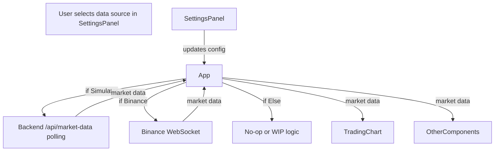

# Market Data Source Switching for BTC/USDT

## Objective

Design a robust, user-switchable market data source system for BTC/USDT, supporting both simulator (backend) and Binance live data, with clear frontend/backend integration and a scalable architecture for future sources.

---

## Architecture Overview

### Data Flow Diagram



### Component Integration

- **SettingsPanel**: Exposes a selector for market data source (`simulator`, `binance`, `else`). Updates the app's config state.
- **App**: Reads the selected data source from config. 
  - If `simulator`: Polls backend as before.
  - If `binance`: Connects to Binance WebSocket, parses 1s kline data, updates market data state.
  - If `else`: Disables data fetching (or shows placeholder).
- **TradingChart** and other consumers: Remain agnostic to the data source; receive market data via props/state.

---

## UI/UX Considerations

- **SettingsPanel**: Add a dropdown or radio group labeled "Market Data Source" with options:
  - Simulator (default)
  - Binance (Live)
  - Else (WIP)
- **Status Display**: Show connection status and errors (e.g., "Connected to Binance", "Simulator offline", "WebSocket error").
- **Switching Behavior**: When the user changes the source, immediately switch data flow and update the UI.

---

## Integration Points & Required Changes

### 1. Types

- Update [`Config`](../frontend/src/types.ts) to include:
  ```ts
  marketDataSource: 'simulator' | 'binance' | 'else';
  ```

### 2. SettingsPanel

- Add a selector for `marketDataSource`.
- Update form state and `handleChange` to support the new field.

### 3. App

- Refactor market data fetching logic:
  - Use a `useEffect` that depends on `config.marketDataSource`.
  - If `simulator`, start polling backend.
  - If `binance`, establish WebSocket connection to Binance, handle ping/pong, parse 1s kline data, and update state.
  - If `else`, disable both.
- Ensure cleanup of polling intervals and WebSocket connections on source change.

### 4. WebSocket Handling

- Encapsulate Binance WebSocket logic:
  - Connect to `wss://stream.binance.com:9443/ws/btcusdt@kline_1s`
  - Handle connection, reconnection, ping/pong, and error events.
  - Parse incoming kline data to match the `MarketData` interface.
  - Expose connection status and errors to the UI.

### 5. TradingChart & Other Consumers

- No changes needed; continue to consume `marketData` from App.

---

## Edge Cases & Error Handling

- **Switching Sources**: Ensure previous polling/WebSocket is cleaned up before starting new source.
- **WebSocket Errors**: Show error status in UI, attempt reconnection with backoff.
- **Backend Down**: Show error if simulator API is unreachable.
- **Binance Data Parsing**: Validate incoming data, handle malformed messages gracefully.
- **Rapid Switching**: Debounce or lock switching to prevent race conditions.

---

## Implementation Steps

1. **Update Types**
   - Add `marketDataSource` to `Config` in [`types.ts`](../frontend/src/types.ts).

2. **Update SettingsPanel**
   - Add a selector for data source.
   - Update form state and handlers.

3. **Refactor App**
   - Refactor `useEffect` to branch on `config.marketDataSource`.
   - Implement cleanup logic for polling/WebSocket.
   - Add state for connection status and errors.

4. **Implement Binance WebSocket Handler**
   - Create a function or custom hook for managing the WebSocket connection.
   - Parse 1s kline data and update `marketData` state.
   - Handle ping/pong, reconnection, and errors.

5. **UI Enhancements**
   - Display connection status and errors in the UI.

6. **Testing**
   - Test switching between sources, error handling, and UI updates.

---

## Example: Binance WebSocket Data Handling

```ts
const ws = new WebSocket('wss://stream.binance.com:9443/ws/btcusdt@kline_1s');
ws.onmessage = (event) => {
  const msg = JSON.parse(event.data);
  if (msg.k && msg.k.x) { // kline closed
    // Parse and update market data state
  }
};
ws.onclose = () => { /* handle reconnect */ };
ws.onerror = (err) => { /* show error */ };
```

---

## Summary

This design enables seamless switching between simulated and live market data, with a scalable architecture for future sources. The UI provides clear controls and feedback, and the system is robust to errors and rapid switching.